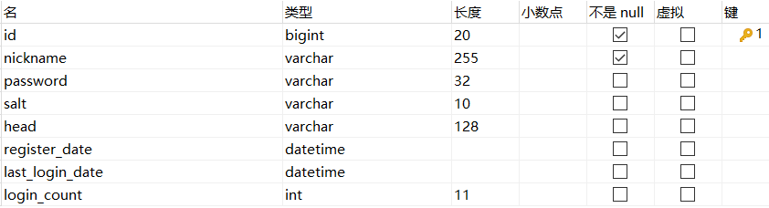

# 商品秒杀系统
### 一、开发环境
- 核心框架：SpringBoot
- 项目构建：jdk1.8、Maven
- 持久层框架：Mybatis
- 模板框架：Thymeleaf
- 数据库：MySQL 5.7
- 消息队列：RabbitMQ
- 缓存：Redis

### 二、功能需求
- **基本功能**   
由于重点是秒杀功能实现和优化，未设计管理员功能（如管理库存，增加商品，修改商品信息等）
1. 实现用户登录功能，两次MD5加密，用户端：PASS=MD5(明文+固定+Salt)，服务端：PASS=MD5(用户输入+随机Salt)
2. 商品页面，查看商品，查看商品详情
3. 参与秒杀，生成秒杀订单

- **秒杀逻辑**
1. 系统数据初始化，在Redis中存入商品库存
2. 收到秒杀请求，判断秒杀标识，可秒杀则Redis减库存，不足直接返回
3. 请求入队，返回结果正在排队
4. 请求出队，生成订单，数据库操作
5. 客户端结果轮询

- **功能优化**
1. 页面缓存、用户信息缓存、系统数据初始化
2. 引入RabbitMQ提高请求处理能力
3. 秒杀唯一标识+Redis预减缓存减少对数据库访问
4. 隐藏订单生成接口地址，定义限流注解
### 三、项目目录

### 四、数据库设计
#### 1.数据表

- 商品列表：goods
- 秒杀商品列表：miaosha_goods
- 秒杀订单表：miaosha_order
- 用户信息表：miaosha_user
- 订单详情表：order_info
#### 2.表结构
**商品列表**

**秒杀商品**

**秒杀订单**  
索引字段`user_id`, `goods_id`

**用户信息**

**订单详情**

